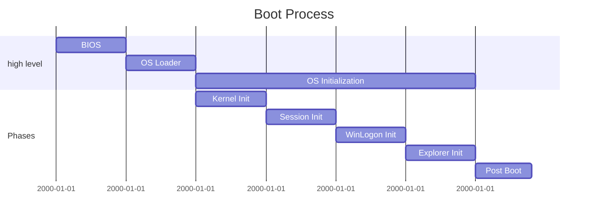

Are you curious about the duration of your system's boot up and time spent in the BIOS/firmware? You can easily find the **Last BIOS time** in the Task Manager.

_Last BIOS time_

Interestingly, there is no user interface to view the last **Post duration**. (🤷) However, it is recorded in the registry and possibly in other places such as Eventlog and WMI.

Here is a PowerShell one-liner to retrieve FwPOSTTime and POSTTime:

```powershell
(Get-ItemProperty -Path "HKLM:\SYSTEM\CurrentControlSet\Control\Session Manager\Power" -Name FwPOSTTime, POSTTime) | select @{Name='FwPOSTTime'; Expression={"{0:N1}s" -f ($_.FwPOSTTime/1000)}}, @{Name='POSTTime'; Expression={"{0:N1}s" -f ($_.POSTTime/1000)}}
```

here is an example output:

```text
FwPOSTTime POSTTime
---------- --------
4.4s      5.9s
```



There is little to no documentation about FwPOSTTime and POSTTime. I think that **FwPOSTTime** is reported by the firmware, so **BIOS**, while **POSTTime** refers to the **OS Loader and OS Initialization**.
